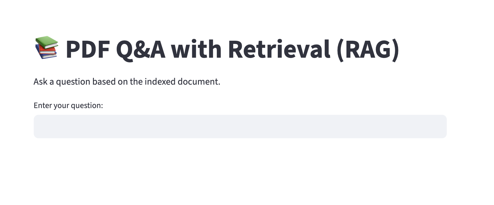
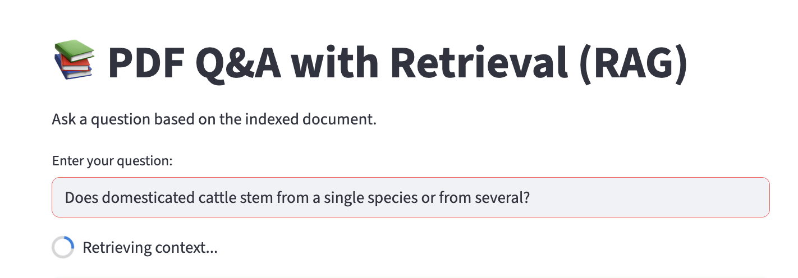
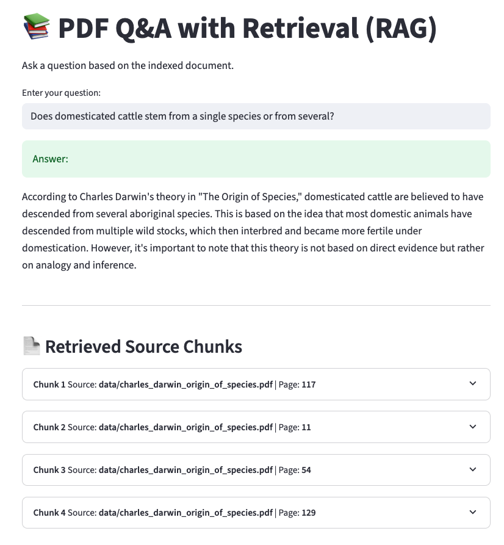
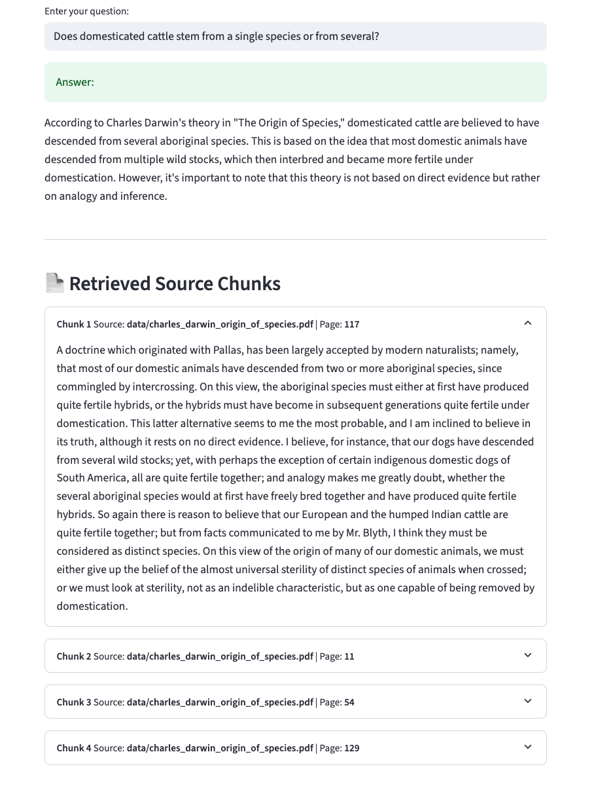

# Retrieval-Augmented Generation (RAG)
This is an implementation of Retrieval-Augmented Generation (RAG) to answer questions from a very long document using Large Language Models (LLMs).

## Motivation
LLMs have context memory limits, meaning they predict the next word based on an input, but the input has to be short enough to fit in the memory. Otherwise the LLMs will only use the last words of the input. In practice, this means that we can't use LLMs to answer questions from very large sources.
Example of what an LLM can do:

input:
"Barcelona and Madrid have pollution levels way above the limits, on the other side Amsterdam has cleaner air.
Which cities should decrease their pollution levels?"


Example of what an LLM can not do:
input:
"Attached you find a report on the pollution levels of Madrid, Barcelona and Amsterdam. Each one is 100 pages. Which cities should decrease their pollution levels? "

## RAG Concept
Since LLMs can't have access to all the context, but we need the context to be able to answer the question, we can do the following:
1. Chunck our document into smaller parts.
2. Vectorize these parts in our documents via an embedding. Now every few sentences is a vector.
3. Vectorize the question (query) using the same embedding.
4. Retrieve the vectors closest to our queries. Since our texts are now vectors, we can calculate distance between vectors, and find the ones more similar to our question.
5. These vectors can be translated back to their text representation.
6. We can attach the text representation to our query to the LLMs.
7. Now the LLMs can answer the question based on our retrieved information, which fit the context limits of our LLM.

## Installation

The code uses free LLMs and assumes that you have Ollama installed localy, if you don't, then follow their instructions to do so [here](https://ollama.com/). You could also modify the code to use providers of paid LLMs.

### 1. Clone the Repository

Clone the Git repository into your folder of choice.

This repo uses [`uv`](https://github.com/astral-sh/uv) as a Python environment and dependency manager. It includes:

- `pyproject.toml` – project and dependency definitions
- `uv.lock` – a lockfile with exact versions for reproducibility

```bash
git clone <your-repo-url> local_code/RAG
cd local_code/RAG
```

### 2. Create the Env
Use uv, the uv.lock and pyproject.toml files to install the environment.

Make sure you have uv installed in your base env. If not do
```shell
pip install uv
```


Then, from the terminal go to the folder where you cloned the repository.
For example:
```shell
cd local_code/RAG
```
Then create the env:
```shell
uv venv .venv
```

This will create a .venv folder in your repository.

Run uv sync to syncronize your environment with the pyproject.toml file
```shell
uv sync
```
After that you can run your code like this:
```shell
uv run streamlit run frontend/app.py
```
Or you can first activate the env
```shell
source .venv/bin/activate
```
And then the code
```shell
streamlit run fronentd/app.py
```

## Generate the vector store
Put your desired pdf document in the code repository and specify the path in the config.yaml file.
Modify the other parameters in the config.yaml file according to your preferences.
Basically, choose an embedding model, define chunking parameters, and output paths for the vector store.

After that run the build_vector_store.py
```python
python build_vector_store.py
```
## Ask questions
Now you can ask questions, to do so run the retriever.py
```python
python retriever.py
```
Or if you want a more user friendly experience run the streamlit app with:
```python
streamlit run frontend/app.py
```
And follow the link, for example http://localhost:8501

You should see something like this:


You can ask a question, and the answer will be generated using RAG.
In my example I used the book The origin of Species by Charles Darwin as a document to answer questions about the book.
!
After submitting the question it might take few seconds to provide the answer, since it needs to vectorize the question, and retrieve the parts of the document that are more likely to contain the info.

And this is the answer, complemented with the information (chunks) from the original document that was used to answer it, providing the source and the page where it is found:


By clicking on each chunk we can see the text of each retrieved information:



## Acknowledgments
This RAG implementation is based on [this repository](https://github.com/emarco177/documentation-helper/blob/2-retrieval-qa/ingestion.py) by Eden Marco.